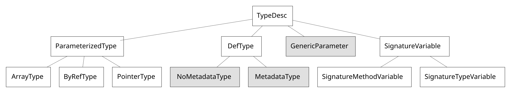

<!--
source: docs/design/coreclr/botr/managed-type-system.md
Source SHA: cf2786c01ce
translator: akeit, AI
updated: 2025-08-10
License: MIT
-->

翻訳元
https://github.com/dotnet/runtime/blob/cf2786c01cebaaf27352808d2fb37a2613876a94/docs/design/coreclr/botr/managed-type-system.md

# マネージド型システム概要

著者: Michal Strehovsky ([@MichalStrehovsky](https://github.com/MichalStrehovsky)) - 2016

## はじめに

マネージド型システムは、AOT および IL 検証のための新世代 .NET ツールの主要コンポーネントです。
これはプログラム内のモジュール、型、メソッド、フィールドを表し、型システムの利用者がさまざまな興味深い質問に答えられるようにする高レベルのサービスを提供します。

マネージド型システムは、[CoreCLR 型システム](type-system.md) を C# で書き直したものです。
私たちは常にランタイム機能を C# で実装したいと考えてきました。マネージド型システムは、そのための基盤です。

型システムが提供する高レベルサービスの例は以下の通りです。

* メタデータから新しい型を読み込む
* 特定の型が実装しているインターフェースの集合を計算する
* 静的フィールドおよびインスタンスフィールドのレイアウト（各フィールドへのオフセット割り当て）を計算する
* 型の静的およびインスタンス GC レイアウト（オブジェクト／クラスデータ内の GC ポインタの特定）を計算する
* VTable レイアウト（仮想メソッドにスロットを割り当てる）を計算し、仮想メソッドをスロットに解決する
* ある型が別の型の位置に格納可能かどうかを判断する

型システムの設計を推進する3つの主要テーマは以下です。

1. 低オーバーヘッドと高パフォーマンス
2. 並行性
3. 拡張性と再利用性

低オーバーヘッドは遅延読み込みで実現します。つまり、型のフィールド、属性、名前などを即座に読み込むのではなく、必要になったときに基盤データソース（メタデータ）から読み込みます。キャッシュは控えめに利用されます。

必要に応じて、継承やポリモーフィズムではなく部分クラス、拡張メソッド、プラグイン可能なアルゴリズムを利用して目標3を達成します。型システムの再利用性はソースレベル（異なる機能セットを得るために異なるファイル群をソースインクルードする）で確保されます。これにより、目標1から外れるような犠牲を払うことなく拡張性を持たせられます。

純粋な形態の型システム（部分クラス拡張を含まない場合）は、[ECMA-335 仕様](https://www.ecma-international.org/publications-and-standards/standards/ecma-335) に定義されていない概念を導入しないよう努めます。本仕様は本書の推奨予備知識であり、本書で使用される様々な用語の定義を提供します。

## メタデータとの関係

メタデータ（ECMA-335 仕様で説明されているファイル形式など）は型システムと密接な関係を持ちますが、両者は明確に区別されます。
メタデータは型の物理的な形（例：型の基底クラスやフィールドの一覧）を記述しますが、型システムはその形の上に高レベルの概念（例：ランタイムで型のインスタンスを格納するのに必要なバイト数、継承されたものを含むインターフェースの一覧）を構築します。

型システムは基盤メタデータへのアクセスを提供しますが、その取得方法を抽象化します。これにより、ECMA-335 以外の形式のメタデータ、または物理的形式を持たない型（例：配列型のメソッド）でも同じ型システムコンテキスト内で表現可能になります。

## 型システムのクラス階層

型システム内で型を表すクラスは次の通りです。

この階層の多くのクラスは、型システムの利用者が派生することを想定しておらず、多くが sealed とされています。

上図で背景が濃く表示されているクラスは拡張可能（実際は抽象クラス）です。具体クラスは、ECMA-335 モジュールファイルからメタデータを読み取るといったロジックに基づき、抽象および仮想メソッドの実装を提供します（型システムには `MetadataType` の実装例として `EcmaType` が既に存在します）。
理想的には、型システム利用者は抽象クラス上で操作し、新しいインスタンス生成時にのみ具体クラスを使用すべきです。`EcmaType` のような具体実装型へのキャストは推奨されません。

## 型システムのクラス

以下は型システム内で型を表すクラスの簡単な説明です。

### TypeDesc

`TypeDesc` は型システム内の全ての型の基底クラスです。全クラスがサポートすべき操作一覧を定義します。
すべての操作がすべての派生型に意味を持つわけではありません（例：ポインタ型に対してメソッド一覧を要求するのは意味がない）が、それぞれの型にとって意味のある実装が提供されます（例：ポインタ型のメソッド一覧は空）。

### ParameterizedType（ArrayType, ByRefType, PointerType）

これらは単一のパラメータを持つ構築型です：

* 配列（多次元配列、または暗黙的に下限0を持つ一次元ベクター）
* マネージ参照
* アンマネージポインタ型

ランク1の多次元配列とベクターの区別は非常に重要で、型システム利用者にとってバグの温床になり得ます。特に注意が必要です。

### DefType（NoMetadataType, MetadataType）

`DefType` は値型、インターフェース、クラスを表します。
ほとんどの `DefType` インスタンスは `MetadataType` の子（型を完全に記述する具体的なメタデータに基づく型）ですが、完全なメタデータが利用できない場合もあります。その場合、GC ヒープ上での型インスタンスのバイト数や値型かどうかといった制限された情報だけが得られます。
型システムはそのような型でも動作できる必要があります。例えば、制限付きメタデータを持つ型が完全メタデータを持つ型の基底型になることや、そのような型のフィールドレイアウトを計算できることが求められます。

### GenericParameter

ジェネリックパラメータとその制約を表します。ジェネリック定義はジェネリックパラメータ上でのインスタンス化として表現されます。

.NET Reflection 型システムに詳しい読者への注記：
.NET Reflection 型システムではジェネリック定義（例：`List<T>`）とジェネリック型のオープンインスタンス（例：`List<!0>`）を区別しませんが、マネージド型システムではこれらを区別します。この区別は、IL メソッド本体内からのメンバ参照を表現する際に重要です。例えば、`LDTOKEN` 命令で `List<T>.Add` を参照する場合は常に未インスタンス化の定義を指し、`List<!0>.Add` を参照する場合はシグネチャ変数を置換した後の具体的メソッドを指します。

### SignatureVariable（SignatureTypeVariable, SignatureMethodVariable）

システム内で他の型に置き換えられる変数を表します。ジェネリックパラメータとは異なり、制約や変性はありません。
単純に「インスタンス化」という処理の中で他の型に置き換えられるプレースホルダです。シグネチャ変数はインデックスを持ち、そのインデックスはインスタンス化コンテキスト内の位置を指します。

## その他の型システムクラス

型システムの利用は、まず型システムコンテキストの作成から始まります。型システムコンテキストは、全ての型が参照同一性を共有する型の宇宙を表します（2つの `TypeDesc` オブジェクトが同一型を表すのは、それらが同一オブジェクトインスタンスである場合に限る）。
型システムコンテキストは宇宙内のすべてのモジュールや構築型を解決します。型システムコンテキスト外で構築型の新しいインスタンスを作成することはできません。

その他の重要なクラスには、`MethodDesc`（型システム内のメソッドを表す）、`FieldDesc`（フィールドを表す）、`ModuleDesc`（単一モジュールを表す）があり、モジュールがアセンブリの場合は `IAssemblyDesc` を実装することもできます。`ModuleDesc` は通常、そのモジュール内の型／メソッド／フィールド定義の所有者であり、それらの参照同一性を維持する責任を負います。

## プラグイン可能なアルゴリズム

型システムが提供するほとんどのアルゴリズム（例：フィールドレイアウトアルゴリズム）はプラグイン可能です。型システムコンテキストは、異なる実装を提供することで使用するアルゴリズムを選択できます。

これらのアルゴリズムは、部分クラスやソースインクルードでは十分でない場面での拡張性メカニズムとして使用されます。特定のアルゴリズムの選択は複数の要因に依存し、型システム利用者はランタイム条件に応じて複数のアルゴリズムを使い分けたい場合があります（例：通常の `DefTypes` のランタイムインターフェース一覧計算と配列型のランタイムインターフェース一覧計算の違い）。

## 型システム内のハッシュコード

型システムの興味深い特性として、コンパイル時と実行時の両方で、システム内の任意の型やメソッドに対して安定したハッシュコードを計算できる点があります。この特性を利用し、AOT コンパイルコード内で高性能なルックアップテーブルを構築します。
ハッシュコードは型名から計算され、コンパイラによって型名が最適化で除去された場合でも利用できるよう、ランタイムデータ構造の一部として保持されます。

## 型システムからの例外スロー

型システム内から例外をスローすることは、単純な `throw` 文よりも複雑です。これは、型システムが多様な場面で使えるよう設計されており、場面ごとに例外のスロー方法の要件が異なるためです。
例えば、ランタイムから型システムを利用する場合、型読み込み失敗時には `System.TypeLoadException` をスローすべきですが、コンパイラや IL 検証器内で発生した場合、同じ例外では実際の管理対象アセンブリの問題と区別がつきません。そのため、別の例外型をスローする必要があります。

例外スローは `ThrowHelper` クラスを介して行われます。型システムの利用者はこのクラスとそのメソッドを定義します。これにより、スローする例外型を制御できます。

型システムは、`TypeSystemException` 基底クラスから派生した例外をスローするデフォルト実装を提供します。これは非ランタイム環境での利用に適しています。

例外メッセージには文字列 ID が割り当てられ、ThrowHelper に渡されます。これはコンパイラシナリオをサポートするためです。AOT コンパイル中に型読み込み例外が発生した場合、AOT コンパイラはユーザーへの警告発行と、実行時に該当型アクセス時に例外をスローするメソッド本体生成という2つの役割を担います。
コンパイラのローカライズがリンク対象のクラスライブラリと一致しない場合もあるため、実際の例外メッセージを文字列 ID 経由にすることで対応します。型システム利用者は、この ThrowHelper を型システム外でも再利用できます。

## 物理的アーキテクチャ

型システムの実装は以下にあります：

* `src/coreclr/tools/Common/TypeSystem/Common`: 型システムの共通部分
* `src/coreclr/tools/Common/TypeSystem/Ecma`: ECMA-335 モジュールファイルからメタデータを読み取る `MetadataType`、`MethodDesc`、`FieldDesc` などの具象実装
* `src/coreclr/tools/aot/ILCompiler.TypeSystem.ReadyToRun.Tests`: 型システムの動作や機能を明らかにする単体テスト。コードを学ぶ入口として適しています。

## CoreCLR 型システムとの主な違い

* マネージド型システムでは、可能な限り正確なジェネリックインスタンス化を `MethodDesc` が持ちます。マネージド型システムにおけるコード共有ポリシーはプラグイン可能なアルゴリズムの1つであり、`MethodDesc` の同一性には影響しません。
  CoreCLR 型システムでは、コード共有ポリシーが `MethodDesc` の同一性と結びついています。この違いの例については [https://github.com/dotnet/runtime/pull/45744](https://github.com/dotnet/runtime/pull/45744) を参照してください。

---