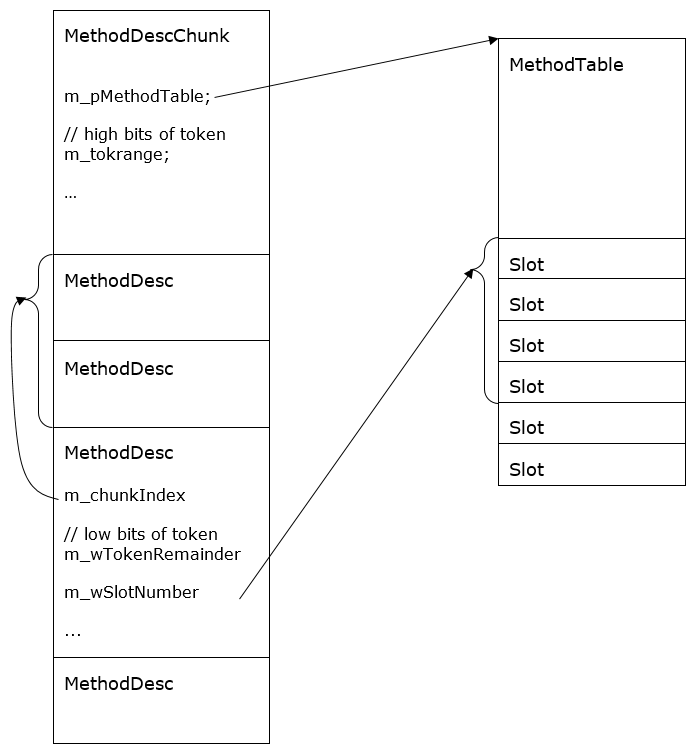
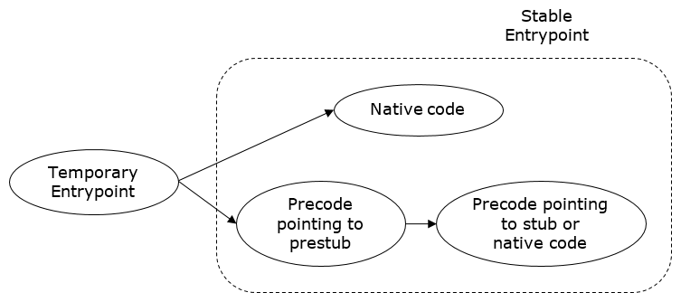
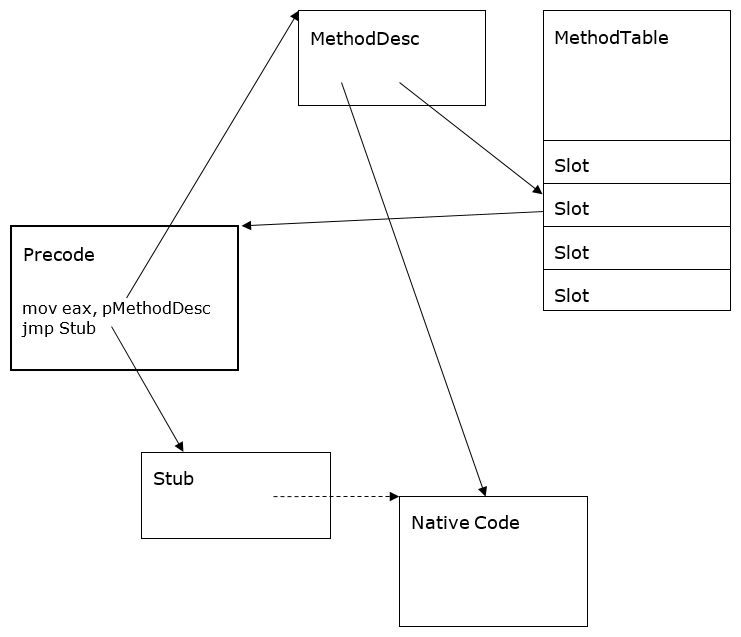

<!--
Translated from: docs/design/coreclr/botr/method-descriptor.md
Source commit: c70367babfe
Translator: akeit0, AI
Date: 2025-08-10
License: MIT
-->

翻訳元
https://github.com/dotnet/runtime/blob/cf2786c01cebaaf27352808d2fb37a2613876a94/docs/design/coreclr/botr/method-descriptor.md


# メソッド ディスクリプタ（Method Descriptor）

著者: Jan Kotas（[@jkotas](https://github.com/jkotas)）— 2006

## はじめに（Introduction）

`MethodDesc`（メソッド ディスクリプタ）は、マネージ メソッドの内部表現です。主な役割は次のとおりです。

- ランタイム全体で使用できる一意のメソッド ハンドルを提供。通常メソッドでは `<module, metadata token, instantiation>` の組に対する一意ハンドル。
- メタデータから計算コストの高い情報（例: static かどうか）をキャッシュ。
- メソッドのランタイム状態（例: 既にコードが生成済みか）を保持。
- メソッドのエントリポイントを所有。

### 設計目標 / 非目標（Design Goals and Non-goals）

- 目標（Performance）: `MethodDesc` は全メソッド分存在するため、サイズ最適化が重視されます。通常の非ジェネリック メソッドでは 8 バイトという小ささです。
- 非目標（Richness）: すべての情報をキャッシュするわけではありません。頻度の低い情報（例: シグネチャ）は基盤のメタデータへアクセスします。

## `MethodDesc` の設計（Design of MethodDesc）

### `MethodDesc` の種類（Kinds of MethodDescs）

- IL: 通常の IL メソッド。
- Instantiated: ジェネリック具体化や、メソッド テーブルに事前スロット非確保など、やや稀な IL メソッド向け。
- FCall: アンマネージ実装の内部メソッド（`MethodImplOptions.InternalCall`）、デリゲート コンストラクタ、tlbimp コンストラクタ。詳しくは [corelib.md](corelib.md)。
- PInvoke: `DllImport` 付きの P/Invoke メソッド。
- EEImpl: ランタイム提供のデリゲート メソッド（Invoke/BeginInvoke/EndInvoke）。[ECMA 335 Partition II - Delegates](../../../../docs/project/dotnet-standards.md)。
- Array: ランタイム提供の配列メソッド（Get/Set/Address）。[ECMA Partition II – Arrays](../../../../docs/project/dotnet-standards.md)。
- ComInterop: COM インターフェイス メソッド（非ジェネリック インターフェイスは既定で COM 相互運用に使用可のため、多くのインターフェイス メソッドが該当）。
- Dynamic: メタデータ非依存の動的生成メソッド（Stub-as-IL / LKG）。

### 代替実装（Alternative Implementations）

`MethodDesc` の種別ごとに C++ の仮想関数・継承で実装するのが自然ですが、各 `MethodDesc` に vtable ポインタが付くためサイズ効率が悪化します（x86 で 4 バイト）。代わりに「種別 3 ビット」で分岐し、必要な処理を切り替えます。例：

```cpp
DWORD MethodDesc::GetAttrs()
{
    if (IsArray())
        return ((ArrayMethodDesc*)this)->GetAttrs();

    if (IsDynamic())
        return ((DynamicMethodDesc*)this)->GetAttrs();

    return GetMDImport()->GetMethodDefProps(GetMemberDef());
}
```

### メソッド スロット（Method Slots）

各 `MethodDesc` は、そのメソッドの現在のエントリポイントを格納する「スロット」を持ちます。抽象メソッドのように実行されないものでも必要です。ランタイム内の複数箇所が「エントリポイント ↔ `MethodDesc`」の対応に依存するためです。

スロットは `MethodTable` 内、または `MethodDesc` 自体のどちらかに存在します。場所は `MethodDesc` 上の `mdcHasNonVtableSlot` ビットで決まります。

- スロット インデックスで効率的に引ける必要がある場合（仮想メソッドやジェネリック型上のメソッドなど）は `MethodTable` に配置し、`MethodDesc` はスロット インデックスを保持します。
- それ以外は `MethodDesc` 自体に持たせ、局所性とワーキングセットを最適化します。`Edit & Continue` 追加メソッド、ジェネリック メソッド具体化、[DynamicMethod](https://github.com/dotnet/runtime/blob/main/src/libraries/System.Private.CoreLib/src/System/Reflection/Emit/DynamicMethod.cs) など、`MethodTable` に事前割当できない場合があるためです。

### `MethodDesc` チャンク（MethodDesc Chunks）

`MethodDesc` は塊（チャンク）で割り当て、省メモリ化します。複数の `MethodDesc` は同一の `MethodTable` やメタデータ トークン上位ビットを共有しがちです。共通情報を `MethodDescChunk` の先頭に持ち上げ、その後ろに `MethodDesc` の配列を置き、各 `MethodDesc` は自身のインデックスのみを持ちます。



図1: MethodDescChunk と MethodTable

### デバッグ（Debugging）

`MethodDesc` のデバッグに役立つ SOS コマンド：

- DumpMD — `MethodDesc` の内容をダンプ

```
!DumpMD 00912fd8
Method Name: My.Main()
Class: 009111ec
MethodTable: 00912fe8md
Token: 06000001
Module: 00912c14
IsJitted: yes
CodeAddr: 00ca0070
```

- IP2MD — コードアドレスから `MethodDesc` を特定

```
!ip2md 00ca007c
MethodDesc: 00912fd8
Method Name: My.Main()
Class: 009111ec
MethodTable: 00912fe8md
Token: 06000001
Module: 00912c14
IsJitted: yes
CodeAddr: 00ca0070
```

- Name2EE — メソッド名から `MethodDesc` を特定

```
!name2ee hello.exe My.Main
Module: 00912c14 (hello.exe)
Token: 0x06000001
MethodDesc: 00912fd8
Name: My.Main()
JITTED Code Address: 00ca0070
```

- Token2EE — トークンから `MethodDesc` を特定（特殊な名前のメソッド探索に有用）

```
!token2ee hello.exe 0x06000001
Module: 00912c14 (hello.exe)
Token: 0x06000001
MethodDesc: 00912fd
8Name: My.Main()
JITTED Code Address: 00ca0070
```

- DumpMT -MD — 指定 `MethodTable` 配下の `MethodDesc` 一覧

```
!DumpMT -MD 0x00912fe8
...
MethodDesc Table
   Entry MethodDesc      JIT Name
79354bec   7913bd48   PreJIT System.Object.ToString()
793539c0   7913bd50   PreJIT System.Object.Equals(System.Object)
793539b0   7913bd68   PreJIT System.Object.GetHashCode()
7934a4c0   7913bd70   PreJIT System.Object.Finalize()
00ca0070   00912fd8      JIT My.Main()
0091303c   00912fe0     NONE My..ctor()
```

デバッグビルドでは、ランタイム状態が深刻に破損し SOS が使えない状況でも役立つよう、`MethodDesc` にメソッド名とシグネチャ文字列がフィールドとして保持される。

## プレコード（Precode）

Precode は「一時エントリポイント」と「スタブの効率的なラッパー」を実現する小さなコード片です。これら 2 つの要件は JIT の一般的な役割から外れるため、専用の軽量コード生成で最適化します。x86 の基本形は次の通りです。

```
mov eax,pMethodDesc // MethodDesc をスクラッチに載せる
jmp target          // 実体へジャンプ
```

効率的なスタブラッパー: ランタイム実装のメソッド（P/Invoke、デリゲート呼び出し、多次元配列の setter/getter など）は、しばしば手書きアセンブリのスタブとして提供されます。Precode はこれらに空間効率の高いラッパーを提供し、複数呼び出し元で共有します。`MethodDesc` とエントリポイントの 1:1 対応を作り、単純で効率的な低レベル構造を実現します。

一時エントリポイント: メソッドが JIT される前から、他の JIT 生成コードが呼べる「アドレス」が必要です。Precode はこの一時エントリポイントを提供します。ターゲットは `PreStub` で、初回実行時にメソッドの JIT を起動し、スレッドセーフな方法で安定エントリポイントに置換します（メソッド生存期間中は不変）。

この手法は JIT の遅延化であり、空間・時間の両面で最適化になる。そうしない場合、実行前にメソッドの推移閉包すべてを JIT しなければならないが、実際には分岐で到達した依存関係（例: if 文の中で選択された経路）だけが JIT を必要とするため無駄が多い。

各一時エントリポイントは、典型的なメソッド本体よりはるかに小さい。数が非常に多いため、性能をある程度犠牲にしてでも小ささを優先する。一時エントリポイントは、当該メソッドの実コードが生成される直前に 1 回だけ実行される。

一時エントリポイントの遷移先は `PreStub` であり、これはメソッドの JIT を起動する特殊なスタブである。`PreStub` は一時エントリポイントをアトミックに安定エントリポイントへ置き換える。安定エントリポイントはメソッドのライフタイムを通じて不変でなければならない。`MethodDesc` のスロットはロックなしで常にアクセスされるため、この不変条件がスレッドセーフティのために必要になる。

「安定エントリポイント」はネイティブ コードか Precode のいずれかである。「ネイティブ コード」は JIT 生成コード、または NGen イメージに保存されたコードのいずれかを指す。実務上は、しばしば「JIT されたコード」という表現でネイティブ コード全般を指すことがある。



図2: エントリポイントの状態遷移図

メソッド本体の実行前に追加の処理が必要な場合、ネイティブ コードと Precode が併存することがある。これは典型的に NGen イメージの fixup が必要な場面で発生する。このケースでは、ネイティブ コードは `MethodDesc` スロットの任意要素（オプション）である。メソッドのネイティブ コードを安価かつ一様に参照できるようにするためである。



図3: Precode・スタブ・ネイティブ コードが最も複雑に絡むケース

### 単回呼び出し vs 複数回呼び出しエントリポイント（Single Callable vs. Multi Callable entry points）

メソッドを呼び出すにはエントリポイントが必要である。`MethodDesc` は、状況に応じて最も効率的なエントリポイントを取得するロジックをカプセル化した API を公開している。鍵となる違いは、そのエントリポイントを「一度だけ」使うのか、「複数回」使うのかである。

例えば、一時エントリポイントを用いて繰り返しメソッドを呼ぶのは悪手になり得る。毎回 `PreStub` を経由してしまうためである。他方で、一度だけ呼ぶために一時エントリポイントを使うのは問題ない。

`MethodDesc` から呼び出し可能アドレスを取得するメソッドは次のとおり。

- `MethodDesc::GetSingleCallableAddrOfCode`
- `MethodDesc::GetMultiCallableAddrOfCode`
- `MethodDesc::TryGetMultiCallableAddrOfCode`
- `MethodDesc::GetSingleCallableAddrOfVirtualizedCode`
- `MethodDesc::GetMultiCallableAddrOfVirtualizedCode`

### プレコードの種類（Types of precode）

Precode には複数の特化型がある。

Precode の種別は、命令列から安価に判別できなければならない。x86/x64 では一定のオフセットの 1 バイトを読むことで判別する。このため、各 Precode 種別を実装する際に利用できる命令列には制約がかかる。

— StubPrecode —

基本形の Precode。スクラッチレジスタに `MethodDesc` をロードし、ジャンプするだけ<sup>2</sup>。Precode 機構の基盤で、どの環境でも実装が必要。他の特化型が使えない場合のフォールバックにもなる。

他の Precode 種別はすべて任意の最適化であり、プラットフォーム別ファイルが `HAS_XXX_PRECODE` 定義で有効化する。

x86 での StubPrecode:

```
mov eax,pMethodDesc
mov ebp,ebp // Precode の種別を示すダミー命令
jmp target
```

「target」は初期状態では prestub を指す。パッチ適用により最終ターゲットを指すようになる。最終ターゲット（スタブまたはネイティブ コード）が `eax` の `MethodDesc` を使う場合もあれば使わない場合もある。スタブはしばしば利用し、ネイティブ コードは通常用いない。

— FixupPrecode —

最終ターゲットがスクラッチレジスタでの `MethodDesc` 受け渡し<sup>2</sup>を必要としない場合に使用する。`MethodDesc` のロードを避けることで数サイクル短縮できる。

使用される多くのスタブはこのより効率的な形式であり、相互運用メソッドで特殊な形式が必要な場合を除き、この形でまかなえる。

x86 における FixupPrecode の初期状態:

```
call PrecodeFixupThunk // この call は復帰しない。戻りアドレスをポップし、
                       // 直後の pMethodDesc を読み出して JIT 対象の
                       // メソッドを特定する
pop esi // Precode の種別を示すダミー命令
dword pMethodDesc
```

最終ターゲットを指すようにパッチ適用後:

```
jmp target
pop edi
dword pMethodDesc
```

<sup>2</sup> スクラッチレジスタで `MethodDesc` を渡すことは、しばしば「MethodDesc Calling Convention」と呼ばれる。

— ThisPtrRetBufPrecode —

戻り値バッファと `this` ポインタを入れ替えるために用いる。値型を返すオープン インスタンス デリゲート向け。`MyValueType Bar(Foo x)` の呼び出し規約を `MyValueType Foo::Bar()` の呼び出し規約へ変換する用途で使う。

この Precode は常にオンデマンドで割り当てられ、実際のメソッド エントリポイントのラッパーとして生成され、`FuncPtrStubs` テーブルに保持される。

ThisPtrRetBufPrecode の形:

```
mov eax,ecx
mov ecx,edx
mov edx,eax
nop
jmp entrypoint
dw pMethodDesc
```

— PInvokeImportPrecode —

アンマネージ P/Invoke ターゲットの遅延バインディングに用いる。利便性とプラットフォーム固有の配線（plumbing）を減らす目的がある。

各 `PInvokeMethodDesc` は通常の Precode に加えて `PInvokeImportPrecode` を持つ。

x86 での PInvokeImportPrecode:

```
mov eax,pMethodDesc
mov eax,eax // Precode の種別を示すダミー命令
jmp PInvokeImportThunk // pMethodDesc の P/Invoke ターゲットを遅延ロード
```
