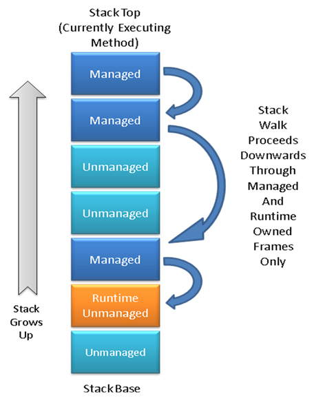

<!--
Translated from: docs/design/coreclr/botr/stackwalking.md
Source commit: c70367babfe
Translator: akeit0, AI
Date: 2025-08-10
License: MIT
-->
CLR におけるスタックウォーキング
===

著者: Rudi Martin ([@Rudi-Martin](https://github.com/Rudi-Martin)) - 2008

CLR（Common Language Runtime）は、スタックウォーキング（またはスタッククロール）と呼ばれる技術を多用します。これは、特定スレッドの呼び出しフレーム列を、最新のもの（スレッドの現在の関数）からスタックの基底に向かって順に反復処理することです。

ランタイムは、以下のようなさまざまな目的でスタックウォークを使用します。

- ガベージコレクション中にすべてのスレッドのスタックを走査し、マネージドルートを探す（マネージドメソッドのフレーム内でオブジェクト参照を保持するローカル変数をGCに報告してオブジェクトを生存させ、GCがヒープ圧縮を決定した場合にはその移動を追跡する）。
- 一部のプラットフォームでは、例外処理の過程でスタックウォーカーが使用される（第1パスでハンドラを探索し、第2パスでスタックをアンワインドする）。
- デバッガがマネージドスタックトレースを生成する際に利用。
- 公開マネージドAPI付近の各種メソッドで、呼び出し元（メソッド、クラス、アセンブリなど）の情報を取得するために使用。

# スタックモデル

ここでは、一般的な用語を定義し、スレッドのスタックの典型的なレイアウトを説明します。

論理的には、スタックはいくつかの _フレーム_ に分割されます。各フレームは、現在実行中の関数（マネージドまたはアンマネージド）または別の関数を呼び出してその戻りを待っている関数を表します。フレームには、その関数呼び出しに必要な状態が含まれます。通常は、ローカル変数領域、別の関数呼び出し時にプッシュされた引数、保存された呼び出し元のレジスタなどです。

フレームの正確な定義はプラットフォームによって異なり、多くのプラットフォームではすべての関数が従う厳密なフレーム形式は存在しません（x86がその例です）。代わりに、コンパイラはフレームの正確な形式を自由に最適化できます。このようなシステムでは、スタックウォークがデバッグ目的で100%正確かつ完全な結果を返すことは保証できません（このためデバッガはpdbなどのデバッグシンボルを利用して、より正確なスタックトレースを生成します）。

しかし、CLRでは完全な汎用スタックウォークは必要ありません。我々が興味を持つのは、マネージドフレーム（マネージドメソッドを表す）と、ランタイム自体の一部を実装するために使用されるアンマネージドコードからのフレームに限られます。特に、3rdパーティ製アンマネージドフレームについては、ランタイムとの遷移位置がわかること以外には正確性を保証しません。

我々が関心を持つフレームの形式は制御可能であり（詳細は後述）、それらは100%正確にクロールできます。必要なのは、離れたランタイムフレームのグループをリンクし、間にあるアンマネージド（かつクロール不可能な）フレームを飛ばすための仕組みだけです。

次の図は、すべてのフレーム種別を含むスタックを示しています（このドキュメントでは、スタックがページ上端方向に伸びるという表記規約を採用しています）。

# フレームをクロール可能にする

## マネージドフレーム

ランタイムはJIT（Just-in-Time）コンパイラを所有し制御しているため、マネージドメソッドが常にクロール可能なフレームを残すようにできます。一つの方法として、全メソッドで固定的なフレーム形式（例: x86 EBPフレーム形式）を使う案があります。しかし実際には、特に小規模なリーフメソッド（典型的にはプロパティアクセサなど）では非効率です。

メソッド呼び出し回数はスタッククロール回数よりも多いため（スタッククロールはランタイム内では比較的まれ）、呼び出し性能を優先し、クロール時に追加の処理を行う方が合理的です。そのためJITは、各メソッドに対応する追加メタデータを生成します。これには、そのメソッドに属するスタックフレームをデコードするための十分な情報が含まれます。

このメタデータは、メソッド内のどこかにある命令ポインタをキーにハッシュテーブルで検索できます。JITは圧縮技術を用いて、このメタデータのサイズ影響を最小限に抑えます。

重要なレジスタ（x86の場合はEIP、ESP、EBPなど）の初期値を元に、スタックウォーカーはマネージドメソッドとそのJITメタデータを見つけ、その情報を使って呼び出し元のレジスタ状態を復元します。この方法で、最新から最古までマネージドメソッドフレームを順にたどれます。この操作は _仮想アンワインド_ と呼ばれます（仮想とは、ESPなどの実レジスタを更新せず、スタックをそのまま残すためです）。

## ランタイムのアンマネージドフレーム

ランタイムは部分的にアンマネージドコード（例: coreclr.dll）で実装されていますが、その多くは「手動管理コード」として、マネージドコードの規約とプロトコルに明示的に従います。例えば、GCプリエンプティブモードの有効化・無効化を明示的に制御し、オブジェクト参照の扱いを管理します。

スタックウォークでも同様に、アンマネージドコードが関与します。C++で書かれたランタイムアンマネージドコードは、マネージドコードのようにフレーム形式を制御できません。しかし、アンマネージドフレームにもGC報告対象のオブジェクト参照や例外処理情報など、スタックウォークで重要な情報を持つ場合があります。

そこで、各アンマネージド関数は「Frame」と呼ばれるデータ構造にその情報をまとめます（名称が紛らわしいですが、このドキュメントではデータ構造としての Frame は大文字で表記します）。

Frame は抽象基底クラスであり、スタックウォークにおいて重要となるさまざまな情報型を表現するためにサブクラス化されます。

Frame は単方向リンクリストを形成し、スレッド構造体が最新のFrameへのポインタを保持します。アンマネージドランタイムコードは必要に応じてFrameをプッシュ／ポップします。

スタックウォーカーは最新から最古の順でFrameをたどります。ただし、マネージドとアンマネージドは混在し、実際の呼び出し順を保つ必要があるため、片方をまとめて処理することはできません。

このため、Frameは必ずそのメソッドのスタックフレーム上に割り当てられます。スタックウォーカーはマネージドフレームの境界を知っており、単純なポインタ比較で、Frameとマネージドフレームのどちらが新しいか判定できます。

こうしてスタックウォーカーは、次の古いフレームとして「仮想アンワインドで得られたマネージドフレーム」または「リンクリスト上の次のFrame」のどちらかを選び、スタック上でより上位（トップに近い）にある方を選びます。

マネージドコードからアンマネージドランタイムコードを呼び出す場合、多くは遷移Frameがプッシュされます。これは、呼び出し元のマネージドメソッドのレジスタ状態を記録し、GC報告対象のオブジェクト参照を追跡するためです。

Frameの詳細な型と用途については [frames.h](https://github.com/dotnet/runtime/blob/main/src/coreclr/vm/frames.h) を参照してください。

# スタックウォーカーインターフェイス

完全なスタックウォークインターフェイスはランタイムのアンマネージドコード専用です（マネージドコードでは `System.Diagnostics.StackTrace` 経由で簡易版が利用可能）。典型的なエントリポイントは `Thread` クラスの `StackWalkFramesEx()` メソッドです。

呼び出し元は、以下の3つを入力として渡します。

1. ウォーク開始コンテキスト（初期レジスタセットまたは初期Frame）
2. コールバック関数とそのコンテキスト
3. コールバックを発生させるフレーム種別を示すフラグ（詳細は [threads.h](https://github.com/dotnet/runtime/blob/main/src/coreclr/vm/threads.h) の `StackWalkFramesEx()` 宣言直前を参照）

戻り値は、正常終了、コールバックによる中断、その他エラーのいずれかを示すenumです。

コールバックには、追加のコンテキストとして `CrawlFrame` が渡されます。`CrawlFrame` は [stackwalk.h](https://github.com/dotnet/runtime/blob/main/src/coreclr/vm/stackwalk.h) に定義され、スタックウォーク中のさまざまなコンテキスト情報を保持します。これには、マネージドフレームの場合の `MethodDesc*`、アンマネージドFrameの場合の `Frame*`、および仮想アンワインドで推定された現在のレジスタセットが含まれます。

# スタックウォークの実装詳細

スタックウォークのさらに低レベルな実装詳細は、本ドキュメントの範囲外です。知識をお持ちの方は、このドキュメントの更新にご協力ください。
