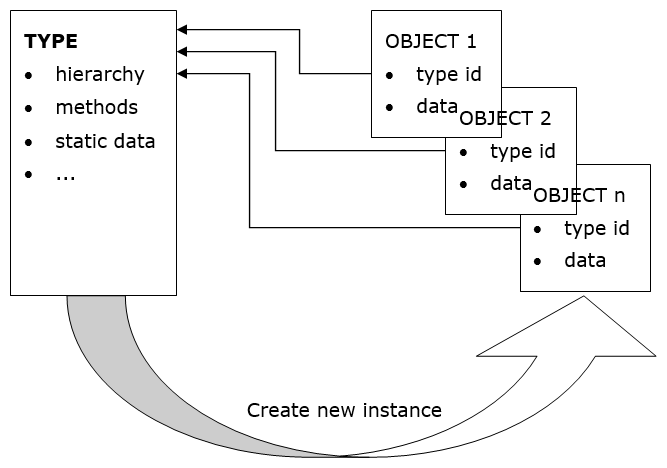
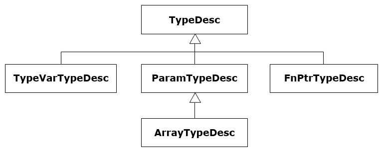
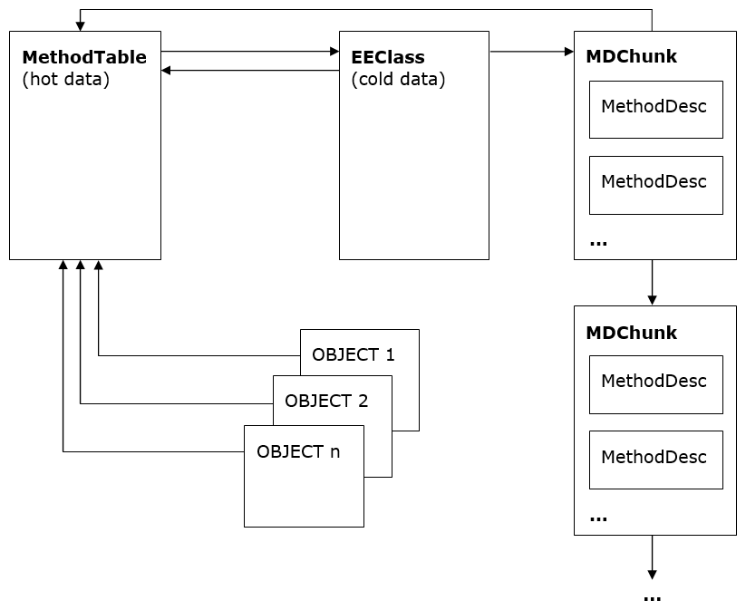
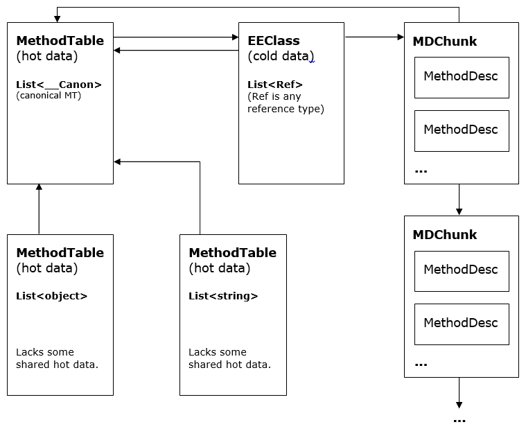

<!--
Translated from: docs/design/coreclr/botr/type-loader.md
Source commit: c70367babfe
Translator: akeit0, AI
Date: 2025-08-10
License: MIT
-->

Type Loader の設計
===

著者: Ladi Prosek - 2007

# はじめに

クラスベースのオブジェクト指向システムでは、型はインスタンスが保持するデータと提供する機能を記述する雛形である。型を定義せずにオブジェクトを生成することはできない。2 つのオブジェクトが同じ型であるとは、同じ型のインスタンスであることを意味し、同一のメンバー集合を持つという事実だけでは関係しない。

上記は典型的な C++ システムにも当てはまる。CLR に本質的に追加される特徴は、ランタイム型情報が完全に利用可能である点である。managed コードを「管理」し型安全な環境を提供するには、ランタイムは常に任意のオブジェクトの型を把握していなければならない。この種の型情報は、照会（例えばすべてのキャスト操作）は頻繁に発生するため、大きな計算を要さず即座に取得できなければならない。

この性能要件は辞書検索的アプローチを退け、次のような高レベルのアーキテクチャを採ることになる。



Figure 1 抽象的な高レベルのオブジェクト設計

実データとは別に、各オブジェクトは型 ID を持つ。これは、その型を表す構造体へのポインタである。これは C++ の v-table ポインタに類似しているが、ここで TYPE と呼ぶこの構造体（後でより厳密に定義する）は v-table 以上の情報を含む。例えば、階層（is-a 関係）に関する情報を含み、継承関係の判定を可能にする。

注1: C# 3.0 の「匿名型」は、フィールドを直接列挙して型を明示せずにオブジェクトを定義できるが、実際にはコンパイラが舞台裏で型を生成している。

## 1.1 関連文献

[1] Martin Abadi, Luca Cardelli, A Theory of Objects, ISBN 978-0387947754

[2] Andrew Kennedy ([@andrewjkennedy](https://github.com/andrewjkennedy)), Don Syme ([@dsyme](https://github.com/dsyme)), Design and Implementation of Generics for the .NET Common Language Runtime

[generics-design]: http://research.microsoft.com/apps/pubs/default.aspx?id=64031

[3] [ECMA CLI 仕様 (ECMA-335)](https://www.ecma-international.org/publications-and-standards/standards/ecma-335)

## 1.2 設計目標

Type Loader（厳密には「class loader」という呼び方は正しくない。class は参照型の下位集合に過ぎず、ローダーは値型も読み込む）は、要求された型を表すデータ構造を構築するのが究極の目的である。ローダーに求める性質は次のとおり。

- 高速な型検索（[module, token] => handle、および [assembly, name] => handle）。
- 作業セットサイズ、キャッシュヒット率、JITted コード性能を高めるための最適化されたメモリレイアウト。
- 型安全性（不正な型は読み込まず TypeLoadException を送出）。
- 並行性（マルチスレッド環境でうまくスケール）。

# 2 Type Loader のアーキテクチャ

ローダーへの入口は比較的少数である。各入口のシグネチャは少しずつ異なるものの、semanticsは互いによく似ている。すなわち、メタデータの token または name 文字列、token のスコープ（module または assembly）、フラグ等を取り、読み込んだエンティティを handle で返す。

JIT 中にはローダーへの呼び出しが多発する。例:

```csharp
object CreateClass()
{
    return new MyClass();
}
```

IL では MyClass はメタデータトークンで参照される。`JIT_New`（実インスタンス化を担う helper）呼出を生成するため、JIT は型を読み込んでその handle を返すようローダーに求める。この handle は JITted コードへ即値として直接埋め込まれる。型やメンバーの解決・読み込みが通常は実行時ではなく JIT 時に行われるため、次のコードで遭遇しやすい挙動の理由も説明できる。

```csharp
object CreateClass()
{
    try {
        return new MyClass();
    } catch (TypeLoadException) {
        return null;
    }
}
```

例えば MyClass が別アセンブリに定義されている想定だが最新版ビルドから誤って削除されていた場合、上のコードはやはり `TypeLoadException` を投げる。catch ブロックが動作しないのは、そのコードが実行されていないからである。例外は JIT 中に発生しており、`CreateClass` を呼び出して JIT を誘発した呼び出し元でのみ捕捉可能である。さらに、インライン化の影響で JIT の発火点が明確でないこともあるため、決定的な挙動を期待・前提にするべきではない。

## 主要データ構造

CLR で最も汎用的な型の指定は `TypeHandle` である。これは、`MethodTable`（`System.Object` や `List<string>` のような「通常の」型）または `TypeDesc`（byref、pointer、function pointer、generic 変数）へのポインタを内包する抽象的な実体で、2 つの handle が等しいのは同じ型を表す場合に限る。領域節約のため、`TypeHandle` が `TypeDesc` を内包している事実はポインタの下から 2 ビット目を 1 に立てて示す（例: (ptr | 2)）。`TypeDesc` は抽象で、以下の継承階層を持つ。



Figure 2 TypeDesc 階層

`TypeDesc`

抽象的な型記述子。具象の記述子種別はフラグで決まる。

`TypeVarTypeDesc`

型変数（`List<T>` の T、`Array.Sort<T>` の T）を表す（generics の節参照）。型変数は複数の型やメソッド間で共有されないため、各変数には固有の所有者が 1 つだけ存在する。

`FnPtrTypeDesc`

関数ポインタを表す。戻り値と引数を指す type handle の可変長リストで、本来は Managed C++ のみで使用されていた。C# では C# 9 からサポートされた。

`ParamTypeDesc`

byref と pointer 型を表す。byref は C# の `ref`／`out` をメソッド引数に適用した結果であり、pointer 型は unsafe C# や Managed C++ で用いられるアンマネージドポインタである。

`MethodTable`

ランタイムの中心となるデータ構造。上記のいずれにも当てはまらないすべての型（プリミティブ型、generic 型（open/closed の双方）を含む）を表す。親型や実装インターフェイス、v-table 等、頻繁に参照される情報を保持する。

`EEClass`

`MethodTable` のデータは作業セットとキャッシュの効率向上のために「hot」と「cold」に分割される。`MethodTable` には定常状態で必要となる「hot」データのみを格納し、`EEClass` には型読み込み、JIT、リフレクション時に主として必要となる「cold」データを格納する。各 `MethodTable` は 1 つの `EEClass` を指す。

さらに generic 型では `EEClass` を共有する。複数の generic 型 `MethodTable` が 1 つの `EEClass` を指すことがあり、この共有は `EEClass` に格納可能なデータに追加の制約を課す。

`MethodDesc`

メソッドを表す。いくつかのバリエーション（サブタイプ）が存在するが大半は本書の対象外である。generics では `InstantiatedMethodDesc` が重要な役割を果たす。詳細は [Method Descriptor Design](method-descriptor.md) を参照。

`FieldDesc`

`MethodDesc` に対応してフィールドを記述する。COM interop の一部のシナリオを除き、EE はプロパティやイベント自体を気にしない。最終的にメソッドとフィールドに還元されるためで、コンパイラとリフレクションが合成・理解することでシンタックスシュガー体験を提供するに留まる。

注2: デバッグの助けになる。`TypeHandle` の値が 2, 6, A, E のいずれかで終わる場合、それは `MethodTable` ではない。追加ビットをクリアすれば `TypeDesc` を検査できる。

注3: `ref` と `out` の違いは引数属性にあるだけで、型システムの観点ではどちらも同じ型である。

## 2.1 Load Level（段階的読み込み）

ローダーが、例えば typedef／typeref／typespec の token と Module により指定された型の読み込みを要求された場合、すべてを一度に原子的に完了するわけではない。読み込みは段階を追って行われる。理由は、型は通常他の型に依存しており、完全に読み込むまで参照を許さないと無限再帰やデッドロックに陥るためである。例:

```csharp
class A<T> : C<B<T>>
{ }

class B<T> : C<A<T>>
{ }

class C<T>
{ }
```

これらは有効な型であり、明らかに `A` は `B` に、`B` は `A` に依存している。

ローダーは最初に、その型を表す構造体を作成し、他の型を読み込まずに取得可能なデータで初期化する。この「依存なし」作業が済むと、その構造体は他所から参照可能になる（通常は他の構造体内にポインタを格納する）。その後、ローダーは段階的に処理を進め、最終的に完全な読み込みに至るまで、より多くの情報で構造体を埋めていく。上の例では、`A` と `B` の基底型は最初は「近似」（互いを含まない表現）で表され、後から実体に置き換えられる。

正確な半読み込み状態は load level と呼ばれる段階で表現される。`CLASS_LOAD_BEGIN` から始まり、`CLASS_LOADED` で終わり、その間にいくつかの中間段階がある。個々の load level の詳細なコメントは [classloadlevel.h](https://github.com/dotnet/runtime/blob/main/src/coreclr/vm/classloadlevel.h) に豊富に記載されている。

より詳しい説明は「Design and Implementation of Generics for the .NET Common Language Runtime」も参照。

### 2.1.1 type loader 内での load level の利用

type loader のさまざまな箇所で動作するコードでは、どの load level を要求できるかに関する異なる規則が適用される。

#### 2.1.1.1 `ClassLoader::CreateTypeHandleForTypeDefThrowing` と `MethodTableBuilder::BuildMethodTableThrowing` 内のコード

`ClassLoader::CreateTypeHandleForTypeDefThrowing` の中で、`MethodTableBuilder::BuildMethodTableThrowing` を呼び出す前に実行されるコードは、読み込み対象の型の `MethodTable` に依存してはならない。これらのルーチン自体が `MethodTable` を構築する役割を持つためである。

この事実はいくつかの含意を持つが、最も明白なのは、読み込み中の型の基底型や、それに関連するインターフェイス／フィールド型を `CLASS_LOAD_APPROXPARENTS` を超えて読み込めないという点である。例えば、基底型を `CLASS_LOAD_EXACTPARENTS` まで読み込むと、`B<A>` から派生した型 `A` を読み込めなくなる。型読み込みの実装上、例外は存在し必要でもあるが、ECMA 仕様と一致しない挙動を招くため、一般には避けるべきである。

#### 2.1.1.2 `ClassLoader::DoIncrementalLoad` 内のコード

`DoIncrementalLoad` 実行中のコードは、一般に、段階的に引き上げようとしているレベル、または既に読み込み対象の型が到達しているレベルのいずれかまでの型読み込みを要求できる。ここでの区別は、型間関係が循環か非循環かにある。型とその型パラメータの関係のような循環関係は、目的のレベルより下のレベルにしか読み込めない。一方、非循環関係は、段階的処理が最終的に到達するレベルまで読み込みを要求できる。

例えば、型とその基底型の関係は非循環である（型は推移的に自分自身を正確な基底型にできない）。しかし、型とその基底型の具象化引数の関係は循環になり得る。

前述の規則の例として `class A : B<A> {}` を考える。`A` を `CLASS_LOAD_EXACTPARENTS` まで読み込む場合、非循環関係であるため基底型 `B<A>` を `CLASS_LOAD_EXACTPARENTS` まで読み込むことを要求できる。しかし `B<A>` を `CLASS_LOAD_EXACTPARENTS` に読み込む際に、循環が生じるため `A` を `CLASS_LOAD_EXACTPARENTS` まで読み込むことは要求できず、`A` は `CLASS_LOAD_APPROXPARENTS` までしか強制できない。

`ClassLoader::DoIncrementalLoad` 内のコードは、概ね、特定の load level まで読み込まれていることに依存しつつ、そのレベルの段階的読み込みが完了したところで、対象の型の load level を引き上げるという単純なパターンに従う。

#### 2.1.1.3 `PushFinalLevels` 内のコード

型読み込みの最後の 2 段階は `PushFinalLevels` で処理され、異なる規則に従う。`PushFinalLevels` は、レベルを引き上げるために、他の型が「目的のレベルより下」に読み込まれていることだけに依存できるコードを実行する。しかし、ある型をより高いレベルに到達したとマークする前に、`PushFinalLevels` は他の型にも同レベルまで `PushFinalLevels` アルゴリズムを完了させることを要求できる。全ての型が新しいレベルに到達したことが確認された時点で、型集合全体を新しいレベルに到達したとマークできる。

### 2.1.2 type loader 外での load level の利用

一般論として、type loader 以外のコードでは load level を無視し、常に「完全に読み込まれた型」を要求するのが望ましい。これが既定であり、常に正しく機能する選択である。ただし性能上の理由から、部分的に読み込まれた型のみを要求することも可能である。その場合、利用側コードは「完全読み込み状態」に依存しないことを自ら保証しなければならない。

## 2.2 Generics

generics を使わない世界では、すべてが単純である。`TypeDesc` で表されない通常の型は 1 つの `MethodTable` を持ち、それが対応する `EEClass` を指し、`EEClass` は逆に `MethodTable` を指す。型の各インスタンスは、最初のフィールド（オフセット 0）として `MethodTable` へのポインタを持つ（すなわち参照値のアドレス）。領域節約のため、当該型で宣言されたメソッドを表す `MethodDesc` は、`EEClass` から指されるチャンクの連結リストにまとめられる注4。



Figure 3 非 generic メソッドのみを持つ非 generic 型

注4: もちろん、managed コードの実行時にメソッド呼び出しを行う際、チャンクを走査してメソッドを探すことはない。メソッド呼び出しは非常に「ホット」な操作で、通常は `MethodTable` 内の情報だけにアクセスすれば足りる。

## 2.2 Generics

### 2.2.1 用語

Constraints（制約）

1. 特殊制約
   - 参照型制約: generic 引数が参照型でなければならない（C# の `class`）。
   - 値型制約: generic 引数が `System.Nullable<T>` 以外の値型でなければならない（C# の `struct`）。
   - 既定コンストラクタ制約: generic 引数が public の引数なしコンストラクタを持つ（C# の `new()`）。

2. 基底型制約: generic 引数が、与えられた非インターフェイス型から派生している（またはその型そのもの）こと。参照型は 0 または 1 個だけを用いるのが妥当である。

3. 実装インターフェイス制約: generic 引数が与えられたインターフェイス型を実装している（またはその型そのもの）こと。0 個以上を指定できる。

上記の制約は暗黙に AND 結合される。すなわち、generic パラメータは特定の型からの派生、複数インターフェイスの実装、既定コンストラクタの保有を同時に求められ得る。宣言型のすべての generic パラメータを制約式で用いることができ、パラメータ間に相互依存が生じ得る。例:

```csharp
public class A<S, T, U>
	where S : T
	where T : IList<U> {
    void f<V>(V v) where V : S {}
}
```

Instantiation（具象化）

generic 型やメソッドの generic パラメータに具体の引数を代入したリスト。読み込まれた generic 型やメソッドはそれぞれ具象化を持つ。

Typical Instantiation（典型具象化）

その型やメソッド自身の型パラメータのみからなり、宣言順と同じ順序で並ぶ具象化。各 generic 型／メソッドに対し 1 つだけ存在する。一般に「open generic 型」と言うときは典型具象化を指すことが多い。例:

```csharp
public class A<S, T, U> {}
```

C# の `typeof(A<,,>)` は ``ldtoken A`3`` にコンパイルされ、ランタイムは `S`, `T`, `U` で具象化された ``A`3`` を読み込む。

Canonical Instantiation（正準具象化）

すべての generic 引数が `System.__Canon` である具象化。`System.__Canon` は corlib に定義された内部型で、よく知られており他のいかなる型とも異なることだけを役割とする。正準具象化を持つ型／メソッドは、すべての具象化の代表として用いられ、共有される情報を保持する。`System.__Canon` はどのような制約も満たせないため、制約チェックは特別扱いされ、`System.__Canon` に対する制約違反は無視される。

### 2.2.2 共有

generics の登場により、ランタイムが読み込む型の数は増加傾向にある。`List<string>` と `List<object>` のように具象化が異なる generic 型は、それぞれ異なる型（各々に `MethodTable` がある）だが、両者が共有できる情報は少なくない。共有はメモリフットプリントに良い影響を与え、ひいては性能にも寄与する。



Figure 4 非 generic メソッドのみを持つ generic 型 ― 共有される EEClass

現在、参照型を含むすべての具象化は同じ `EEClass` とその `MethodDesc` を共有する。これは参照がすべて同じサイズ（4 または 8 バイト）であり、従って型レイアウトが同一だからである。図は `List<object>` と `List<string>` の例を示す。正準の `MethodTable` は、最初の参照型具象化が読み込まれる前に自動的に作成され、非仮想スロットのように、ホットだが具象化に依存しないデータを保持する。値型のみからなる具象化は共有されず、そのような各具象化は共有されない `EEClass` を持つ。

これまでに読み込まれた generic 型を表す `MethodTable` は、ローダーモジュールが持つハッシュテーブルにキャッシュされる注5。新しい具象化を構築する前にこのハッシュテーブルを参照し、同じ型を表す `MethodTable` が複数存在しないようにする。

詳細は「Design and Implementation of Generics for the .NET Common Language Runtime」参照。

注5: NGEN イメージから読み込まれる型では状況がいくぶん複雑になる。
