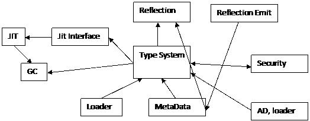
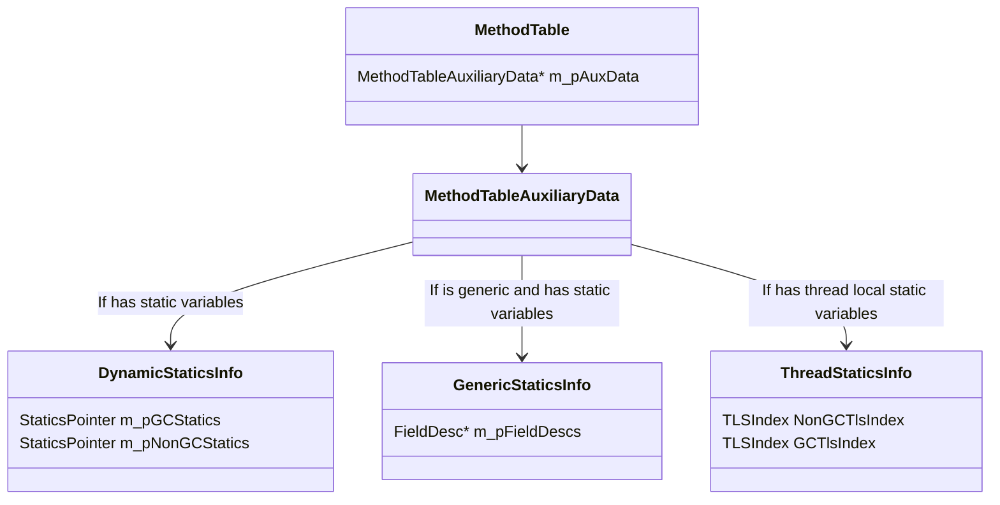
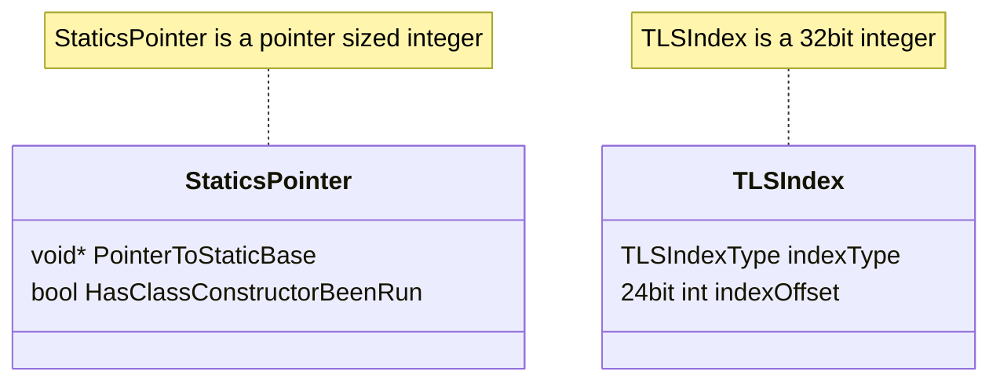
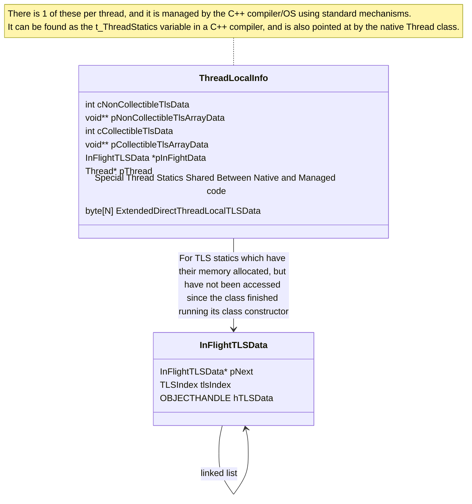

<!--
Translated from: docs/design/coreclr/botr/type-system.md
Source commit: c70367babfe
Translator: akeit0, AI
Date: 2025-08-10
License: MIT
-->
翻訳元
https://github.com/dotnet/runtime/blob/cf2786c01cebaaf27352808d2fb37a2613876a94/docs/design/coreclr/botr/type-system.md

Type System の概要
====================

著者: David Wrighton ([@davidwrighton](https://github.com/davidwrighton)) - 2010

はじめに
============

CLR の型システムは、ECMA 仕様で記述された型システムに拡張を加えたものの表現である。

概要
--------

型システムは一連のデータ構造（その一部は本 BOTR の他章で説明）と、それらのデータ構造を操作・生成するアルゴリズム群から構成される。ここで述べるのはリフレクションが公開する型システムそのものではないが、リフレクションはこのシステムに依存している。

型システムが保持する主なデータ構造:

- MethodTable
- EEClass
- MethodDesc
- FieldDesc
- TypeDesc
- ClassLoader

型システムに含まれる主なアルゴリズム:

- Type Loader: 型を読み込み、型システムの主要データ構造の大半を作成する。
- CanCastTo など: 型同士の比較機能。
- LoadTypeHandle: 主に型の検索に使用する。
- Signature parsing: メソッドやフィールドの比較・情報取得に使用する。
- GetMethod/FieldDesc: メソッド／フィールドの検索・読み込みに使用する。
- Virtual Stub Dispatch: インターフェイスへの仮想呼び出し先の解決に使用する。

CLR の他の部分へ種々の情報を提供する補助的なデータ構造やアルゴリズムは他にも多数存在するが、システム全体の理解においては重要度が低い。

コンポーネント構成
----------------------

型システムのデータ構造は、さまざまなアルゴリズムから一般的に利用される。本書では型システムのアルゴリズム（それらは他の BOTR 章で扱う）を説明しないが、主要なデータ構造については以下で説明する。

依存関係
------------

型システムは CLR の多くの部分に提供されるサービスであり、主要なコンポーネントの大半が型システムの挙動に何らかの依存を持つ。次の図は型システムに影響を与える一般的なデータフローを示す。網羅的ではないが、主要な情報の流れを示している。

### 本コンポーネントが依存するもの

型システムの主な依存先は次のとおり。

- ローダー: 作業対象となる正しいメタデータの取得に必要。
- メタデータシステム: 情報収集のためのメタデータ API を提供する。
- セキュリティシステム: ある型システム構造（例: 継承）の可否を型システムに通知する。
- AppDomain: 型システムのデータ構造の割当動作を扱う LoaderAllocator を提供する。

### 本コンポーネントに依存するもの

型システムに依存する主要な構成要素は 3 つある。

- JIT インターフェイスと JIT helper: 主に型・メソッド・フィールドの検索機能に依存する。型システムのオブジェクトが見つかると、返されるデータ構造は JIT が必要とする情報を提供できるように調整されている。
- Reflection: ECMA 標準の概念に比較的単純にアクセスできるよう、型システム（のデータ構造）を利用する。
- 一般的な managed コードの実行: 型比較ロジックと Virtual Stub Dispatch のために型システムを必要とする。

Type System の設計
=====================

中核の型システムのデータ構造は、実際に読み込まれた型を表現するもの（例: TypeHandle、MethodTable、MethodDesc、TypeDesc、EEClass）と、読み込み済みの型を見つけられるようにするもの（例: ClassLoader、Assembly、Module、RIDMaps）である。

型読み込みのためのデータ構造とアルゴリズムは、BOTR の [Type Loader](type-loader.md) および [MethodDesc](method-descriptor.md) 章で扱う。

これらのデータ構造を結び付けるのが、JIT／Reflection／TypeLoader／stackwalker が既存の型やメソッドを見つけられるようにする機能群である。一般的な考え方として、これらの検索は ECMA CLI 仕様で規定されたメタデータトークン／シグネチャを起点に容易に行えるべきである。

最後に、適切な型システムのデータ構造が見つかった後には、型から情報を収集したり、2 つの型を比較したりするアルゴリズムが用意されている。特に複雑な例としては、BOTR の [Virtual Stub Dispatch](virtual-stub-dispatch.md) 章がある。

設計目標と非目標
--------------------------

### 目標

- 実行中（非リフレクション）コードが実行時に必要とする情報へのアクセスが非常に高速であること。
- コード生成時に必要とする情報へのアクセスが簡潔であること。
- ガベージコレクタ／stackwalker がロックを取得せず、メモリ割当もせずに必要な情報へアクセスできること。
- 一度に読み込む型の数を最小限にすること。
- 型読み込み時に当該型から読み込む情報量を最小限にすること。
- 型システムのデータ構造は NGEN イメージに格納可能であること。

### 非目標

- メタデータの全情報を CLR のデータ構造に直接反映すること。
- すべてのリフレクションの使用を高速にすること。

managed コード実行時に用いられる典型アルゴリズムの設計
------------------------------------------------------------------------------

キャストのアルゴリズムは、managed コードの実行中に型システムで頻繁に使用されるアルゴリズムの典型例である。

このアルゴリズムには少なくとも 4 つの入口があり、それぞれが異なる高速経路を提供するように選ばれている。最良の性能を目指すためである。

- 特定の非配列・非 type-equivalent 型へオブジェクトをキャストできるか。
- 変性を実装しないインターフェイス型へオブジェクトをキャストできるか。
- 配列型へオブジェクトをキャストできるか。
- ある型のオブジェクトを任意の他の managed 型へキャストできるか。

最後のもの以外は一般性を犠牲にして最適化されている。

例えば「型を親型へキャストできるか」（上記 1 の変種）は、単方向リストを走査する単一ループで実装される。検索できるキャスト操作の範囲は限定されるが、強制しようとしているキャスト先の型を調べれば適用範囲かどうかを判定できる。このアルゴリズムは JIT helper の JIT_ChkCastClass_Portable に実装されている。

前提:

- 用途特化の実装は一般に性能改善となる。
- アルゴリズムの複数バージョンは、保守の面で克服不能な問題にはならない。

型システムにおける典型的な探索アルゴリズムの設計
-----------------------------------------------------

型システムには、この共通パターンに従うアルゴリズムがいくつか存在する。

型システムは型の発見に一般的に用いられる。契機は JIT、リフレクション、シリアライゼーション、リモーティングなど多岐にわたる。

この場合の基本入力は以下である。

- 検索を開始するコンテキスト（Module または Assembly のポインタ）。
- 初期コンテキストにおいて目的の型を表す識別子。典型的にはトークン、または（Assembly が検索コンテキストである場合は）文字列。

アルゴリズムはまず識別子を復号する。

型探索のシナリオでは、トークンは TypeDef／TypeRef／TypeSpec のいずれか、または文字列である。識別子の種別ごとに探索が異なる。

- typedef トークン: Module の RidMap を検索する（単純な配列インデクシング）。
- typeref トークン: 参照先の Assembly を解決し、その Assembly のポインタと typeref テーブルから得た文字列を用いて探索をやり直す。
- typespec トークン: シグネチャの解析が必要。解析により型読み込みに必要な情報を得る（再帰的にさらなる型探索が発生する）。
- 名前: アセンブリ間のバインディングに使用する。TypeDef／ExportedTypes テーブルで一致を検索する（マニフェスト Module 上のハッシュテーブルで最適化）。

この設計から、型システムの探索アルゴリズムに共通する性質が見て取れる。

- 探索はメタデータに密接に結び付いた入力を用いる。特にメタデータトークンや名前文字列が頻繁にやり取りされる。また探索は Module に結び付けられ、これは .dll／.exe に直接対応する。
- 性能向上のため、RidMap やハッシュテーブルなどのキャッシュ的データ構造を用いる。
- 入力に応じて 3〜4 つの経路（分岐）を持つ。

この一般設計に加えて、さらに次の要件が重なる。

- ASSUMPTION: 既に読み込まれている型の探索は、GC 停止中でも安全に行える。
- INVARIANT: 一度読み込まれた型は、探索すれば必ず見つかる。
- ISSUE: 探索ルーチンはメタデータ読み取りに依存するため、状況によっては性能が不十分になり得る。

この探索アルゴリズムは JIT 中に用いられるルーチンの典型であり、次の性質を持つ。

- メタデータを使用する。
- 多数の場所からデータを探す必要がある。
- データ構造の重複が比較的少ない。
- 深い再帰やループを持たない。

これにより、IL ベースの JIT が必要とする性能要件や特性を満たす。

Garbage Collector が型システムに求める要件
-------------------------------------------------

GC は GC ヒープに確保された型のインスタンスに関する情報を必要とする。これは各 managed オブジェクトの先頭にある型システムのデータ構造（MethodTable）へのポインタを介して行われる。MethodTable には、その型インスタンスの GC レイアウトを記述するデータ構造が付随する。レイアウトには 2 つの形式（通常型・オブジェクト配列用と、値型配列用）がある。

- ASSUMPTION: 型システムのデータ構造の寿命は、当該データ構造が表す managed オブジェクトの寿命よりも長い。
- REQUIREMENT: GC はランタイム停止中に stack walker を実行する必要がある（次節で述べる）。

Stackwalker が型システムに求める要件
-------------------------------------------

stack walker／GC stack walker は 2 つの場面で型システムの入力を要する。

- スタック上の値型のサイズを求めるとき。
- スタック上の値型内に報告すべき GC ルートを見つけるとき。

型の遅延読み込みを志向し、また関連する GC 情報だけが異なる複数バージョンのコード生成を避けたい等の理由により、現在の CLR では、スタック上のメソッドについてシグネチャの走査が必要になる。この需要は、stack walker が非常に特定のタイミングで実行される必要があるため頻度は低いが、信頼性目標を満たすために、シグネチャ走査は stackwalking 中でも機能しなければならない。

stack walker は概ね 3 つのモードで実行される。

- セキュリティや例外処理の理由で現在スレッドのスタックを走査する。
- GC のために全スレッドのスタックを走査する（EE により全スレッドが停止されている）。
- プロファイラのために特定スレッドのスタックを走査する（そのスレッドが停止されている）。

GC のスタック走査とプロファイラのスタック走査では、スレッド停止のためメモリ割当や多くのロック取得は安全ではない。

この要件を満たすため、型システムには上記制約に従う経路を設けている。

この目標のために型システムに課された規則は次のとおり。

- あるメソッドが呼び出されているなら、そのメソッドの値型パラメータはプロセス中のいずれかの AppDomain に読み込まれている。
- シグネチャを保持するアセンブリから、その型を実装するアセンブリへの参照は、スタック走査の一部としてシグネチャを走査する必要が生じる前に解決されていなければならない。

これは、型ローダー、NGEN イメージ生成プロセス、JIT の内部で広範かつ複雑な仕組みによって強制されている。

- ISSUE: stackwalker が型システムに課す要件は極めて脆い。
- ISSUE: 型システム内の各関数で、読み込み済み型の検索に触れ得る箇所に契約違反のセットを必要とする。
- ISSUE: 実施されるシグネチャ走査は通常のシグネチャ走査コードで行う。このコードは走査中に型を読み込む設計だが、ここでは「実際には型読み込みが起きない」という前提で用いる。
- ISSUE: 要件の充足には型システムだけでなくアセンブリローダーの支援も必要であり、ローダー側にはこの点でいくつかの課題がある。

## Static variables

CoreCLR の static 変数は、「static base」を取得し、そこからオフセットを加えて実際の値へのポインタを得る仕組みで扱う。各フィールドごとに static base を non-gc と gc に分類する。現在、non-gc statics はプリミティブ型（byte, sbyte, char, int, uint, long, ulong, float, double, 各種ポインタ）や enum で表される static を指す。GC statics はクラスまたは非プリミティブ値型で表される static を指す。値型の GC static の場合、static 変数は実際には値型の boxed インスタンスへのポインタである。

### 型ごとの static 変数情報

.NET 9 以降、static base は当該の型ごとに結び付く。次の図にあるように、statics のデータは `MethodTable` から取得でき、`DynamicStaticsInfo` を介して statics ポインタを取るか、`ThreadStaticsInfo` から TLSIndex を取得してスレッド static 変数システムを介して実際のスレッド static base を得る。

上図のとおり、non-gc と gc、thread と通常の statics でフィールドを分けている。通常の statics では 1 つのポインタサイズのフィールドを用い、クラスコンストラクタが実行済みかどうかの情報も同じフィールドに符号化する。これにより、static フィールドのアドレス取得とクラスコンストラクタ起動の要否判定をロックフリーかつアトミックに行える。TLS statics では、クラスコンストラクタの実行有無の判定はより複雑で、thread statics インフラの一部として扱う。`DynamicStaticsInfo` と `ThreadStaticsInfo` はロックなしでアクセスされるため、これらの構造体上のフィールドはメモリアクセス 1 回で読み取れるようにして、メモリ順序の引き裂きを避ける必要がある。

また generic 型については、各フィールドに `FieldDesc` が存在し、これはタイプインスタンスごとに割当てられ、複数の正準インスタンス間で共有しない点も重要である。

#### 収集可能 static のライフタイム管理

CoreCLR には collectible assembly の概念があるため、static 変数のライフタイム管理が必要である。選択したアプローチは、ランタイムのデータ構造から GC ヒープ上の managed オブジェクト内部を指すポインタを保持できる特殊な GC ハンドル型を用意することである。

ここでの要件は、static 変数が自分自身の collectible assembly を生存させ続けることがないようにすることで、collectible statics は、collectible assembly の最終的な回収前に存続し、ファイナライズされ得るという特異な性質を持つ。もし蘇生（resurrection）が生じると、意外な挙動につながり得る。

### Thread Statics

Thread statics は、静的を含む型の寿命と、その静的にアクセスしたスレッドの寿命のうち短い方を寿命とする静的変数である。`[System.Runtime.CompilerServices.ThreadStaticAttribute]` が付与された型上の静的変数として作成される。一般的な仕組みは、各スレッドで効率的にアクセスできるデータ構造を保持し、全スレッドで共通の「インデックス」を型に割り当てるというものだが、実装上いくつか特異点がある。

1. 収集可能と非収集可能の thread statics を分離する（`TLSIndexType::NonCollectible` と `TLSIndexType::Collectible`）。
2. 非 GC の thread static を、ネイティブ CoreCLR コードと managed コードの間で共有できる（`TLSIndexType::DirectOnThreadLocalData` の一部）。
3. 少数の非 GC thread statics へ極めて効率的にアクセスできる手段を提供する（`TLSIndexType::DirectOnThreadLocalData` の残りの用途）。

#### Per-Thread Statics のデータ構造

#### thread static アドレス取得のアクセスパターン

次は `DirectOnThreadLocalData` でない thread static に JIT がアクセスする際のパターンである。

0. 何らかの方法で TLS インデックスを取得する。
1. 現在スレッドの OS 管理 TLS ブロックへのポインタを取得する（例: `pThreadLocalData = &t_ThreadStatics`）。
2. 整数値を 1 つ読む（`pThreadLocalData->cCollectibleTlsData` または `pThreadLocalData->cNonCollectibleTlsData`）。
3. cTlsData を目的のインデックスと比較する（`if (cTlsData < index.GetIndexOffset())`）。
4. インデックスが範囲外なら手順 11 へジャンプ。
5. TLS ブロックからポインタ値を 1 つ読む（`pThreadLocalData->pCollectibleTlsArrayData` または `pThreadLocalData->pNonCollectibleTlsArrayData`）。
6. TLS 配列内からポインタを 1 つ読む（`pTLSBaseAddress = *(intptr_t*)(((uint8_t*)pTlsArrayData) + index.GetIndexOffset()`）。
7. そのポインタが NULL なら手順 11 へ（`if pTLSBaseAddress == NULL`）。
8. TLS インデックスが Collectible でなければ `pTLSBaseAddress` を返す。
9. `ObjectFromHandle((OBJECTHANDLE)pTLSBaseAddress)` が NULL なら手順 11 へ。
10. `ObjectFromHandle((OBJECTHANDLE)pTLSBaseAddress)` を返す。
11. helper を末尾呼出し（`return GetThreadLocalStaticBase(index)`）。

次は `DirectOnThreadLocalData` 上にある thread static に JIT がアクセスする際のパターンである。
0. 何らかの方法で TLS インデックスを取得する。
1. 現在スレッドの OS 管理 TLS ブロックへのポインタを取得（例: `pThreadLocalData = &t_ThreadStatics`）。
2. ThreadLocalData 構造体の先頭にインデックスのオフセットを加算（`pTLSBaseAddress = ((uint8_t*)pThreadLocalData) + index.GetIndexOffset()`）。

#### thread static 変数のライフタイム管理

効率のため、collectible と non-collectible の thread static 変数を区別する。

non-collectible thread static は、ランタイムによって回収されない型に定義された thread static であり、実際の使用ではこちらが多数派である。`DirectOnThreadLocalData` の statics はこの下位集合で、特別に最適化された形式を持ち、GC レポートを必要としない。non-collectible thread statics の場合、`ThreadLocalData` のポインタ（`pNonCollectibleTlsArrayData`）は managed の `object[]` を指し、その配列が `object[]`／`byte[]`／`double[]` の各配列を指す。GC スキャン時には、最初の object[] へのポインタのみを GC に報告すればよい。

collectible thread static は、ランタイムによって回収され得る型に定義された thread static である。`ThreadLocalData` 内のポインタ（`pCollectibleTlsArrayData`）は `malloc` により確保されたメモリチャンクを指し、その中に `object[]`／`byte[]`／`double[]` へのポインタを保持する。GC スキャン時には、各 managed オブジェクトは、その型とスレッドが存続している場合に限り個別に生存させる必要がある。このため、次の状況を正しく扱う必要がある。
1. collectible assembly が参照されなくなったが、紐付く thread static 変数がファイナライザを持つ場合、そのオブジェクトはファイナライゼーションキューへ移されなければならない。
2. collectible assembly に紐付く thread static 変数が、オブジェクト参照の連鎖を通じて当該 assembly の `LoaderAllocator` を参照している場合でも、そのことが assembly を参照済みと見なす根拠になってはならない。
3. collectible assembly が回収された場合、関連する static 変数は存在しなくなり、当該 assembly に結び付く TLSIndex は再利用可能になる。
4. スレッドがもはや実行していない場合、そのスレッドに紐付くすべての thread statics は生存させない。

採用した手法は 2 種類のハンドル型を用いるものである。効率的なアクセスのため、動的に拡張される配列に格納するハンドル型は WeakTrackResurrection GCHandle とする。このハンドルは TLS データのスロットに結び付けられ、具象化に固有ではないため、関連する collectible assembly が回収されてスロットが再利用されても、同じインスタンスを再利用できる。さらに、使用中の各スロットには `LOADERHANDLE` を持たせ、`LoaderAllocator` が解放されるまでオブジェクトを生存させる。`LoaderAllocator` が回収された場合、この `LOADERHANDLE` は放棄されるが問題ない。`LoaderAllocator` が回収されない場合にのみ後始末が必要だからである。スレッド終了時には、TLS 配列中の collectible な各スロットについて、適切な `LoaderAllocator` 上の `LOADERHANDLE` を明示的に解放する。

物理構成
=====================

型システムの主要部分は次のファイルにある。

- Class.cpp/inl/h – EEClass 関数および BuildMethodTable
- MethodTable.cpp/inl/h – MethodTable 操作用関数
- TypeDesc.cpp/inl/h – TypeDesc 調査用関数
- MetaSig.cpp SigParser – シグネチャ処理
- FieldDesc / MethodDesc – それぞれのデータ構造の調査用関数
- Generics – Generics 固有のロジック
- Array – 配列処理に必要な特別扱い
- VirtualStubDispatch.cpp/h/inl – Virtual Stub Dispatch のコード
- VirtualCallStubCpu.hpp – Virtual Stub Dispatch のプロセッサ固有コード
- threadstatics.cpp/h – スレッド static 変数の処理

主要な入口点は BuildMethodTable、LoadTypeHandleThrowing、CanCastTo*、GetMethodDescFromMemberDefOrRefOrSpecThrowing、GetFieldDescFromMemberRefThrowing、CompareSigs、VirtualCallStubManager::ResolveWorkerStatic である。

関連文献
===============

- [ECMA CLI 仕様](../../../project/dotnet-standards.md)
- [Type Loader](type-loader.md)（BOTR 章）
- [Virtual Stub Dispatch](virtual-stub-dispatch.md)（BOTR 章）
- [MethodDesc](method-descriptor.md)（BOTR 章）
